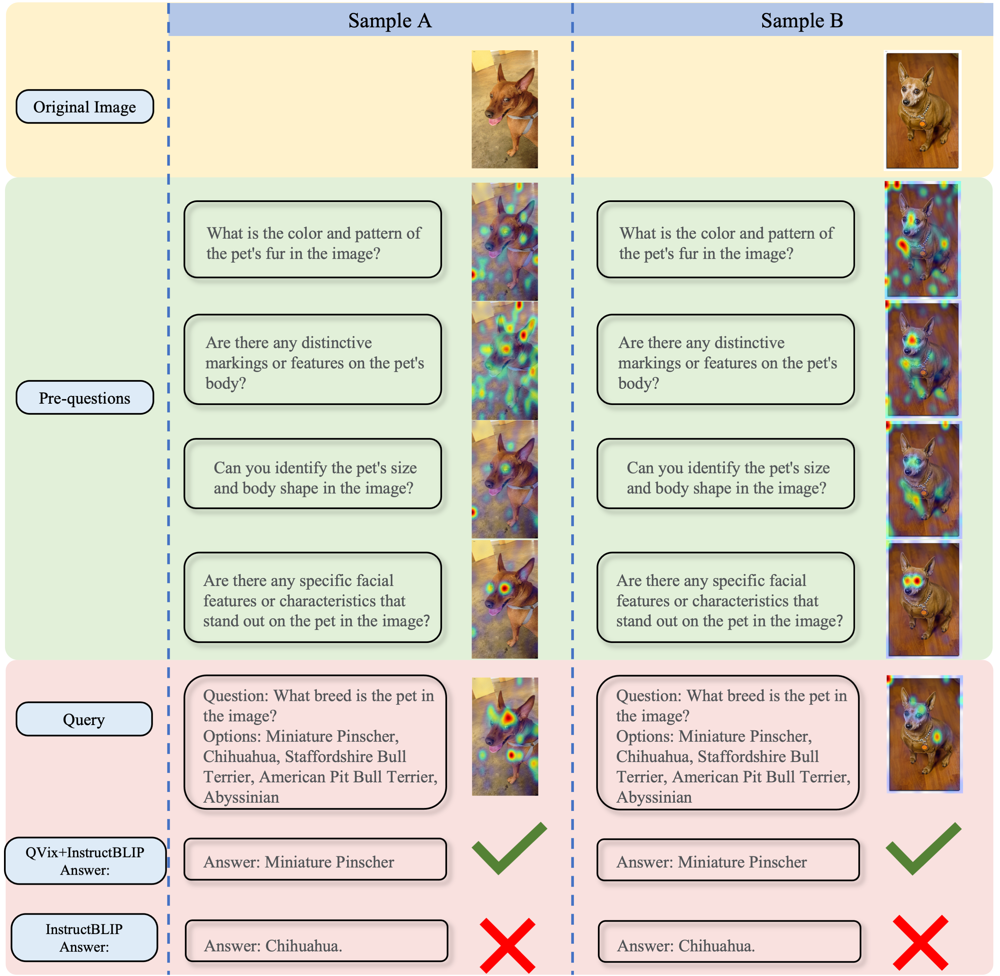
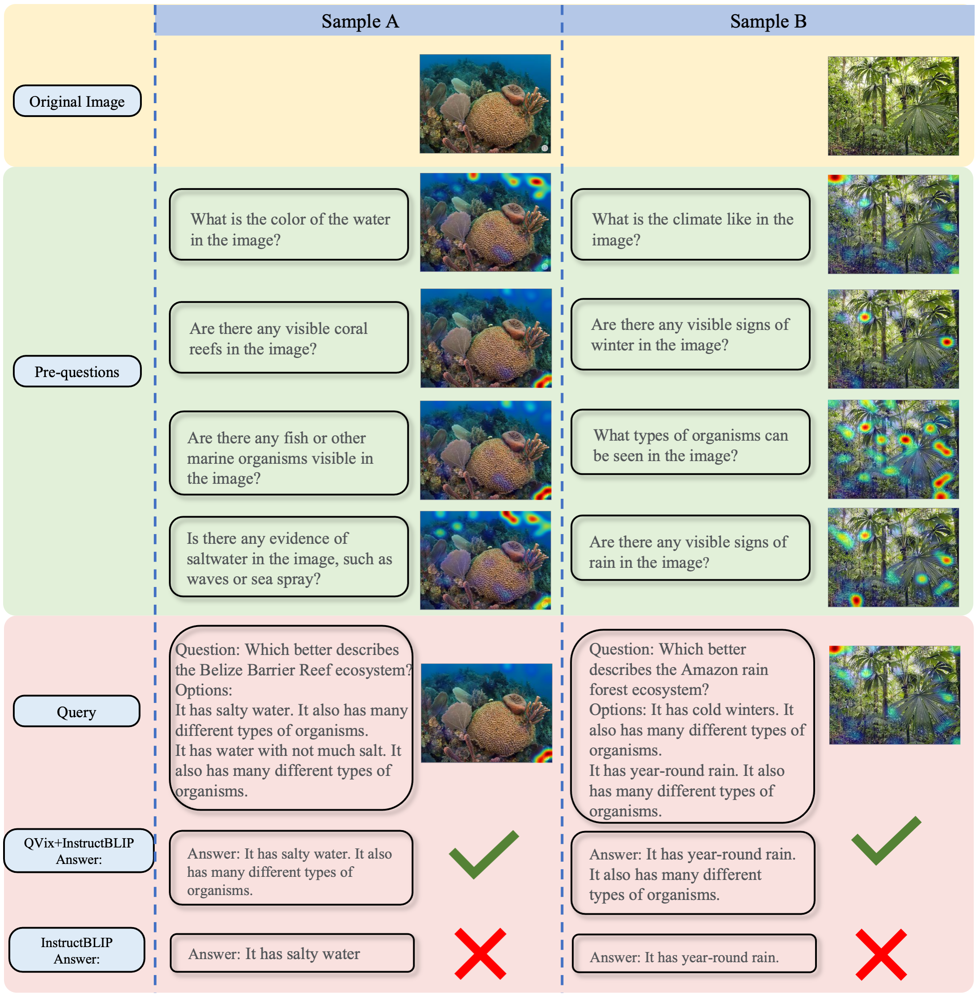

# Good Questions Help Zero-Shot Image Reasoning

[Good Questions Help Zero-Shot Image Reasoning](https://arxiv.org/pdf/2312.01598.pdf)

QVix leverages LLMs' strong language prior to generate input-exploratory questions with more details than the original query, guiding LVLMs to explore visual content more comprehensively and uncover subtle or peripheral details. QVix enables a wider exploration of visual scenes, improving the LVLMs’ reasoning accuracy and depth in tasks such as visual question answering and visual entailment.

<p align="center" width="100%">
<a ></a>
</p>

## Cases

QVix can utilize **detailed information** to better distinguish between options that are easily confused, and achieve a more comprehensive and systematic understanding of images through **contextual information**.

#### Case 1. Detailed Information: Miniature Pinscher vs. Chihuahua 

<p align="center" width="60%">
<a ></a>
</p>

#### Case 2. Contextual Information: Describe the system depicted in the image

<p align="center" width="60%">
<a ></a>
</p>

## Getting Started
**1. Installation**

Git clone our repository and creating conda environment:
```bash
git clone https://github.com/kai-wen-yang/QVix.git
cd QVix
conda create -n QVix python=3.10
conda activate QVix
pip install -r requirements.txt
```

Add directory to PYTHONPATH:
```bash
cd QVix/models
export PYTHONPATH="$PYTHONPATH:$PWD"
```

**2. Prepare dataset**

You should replace the variable `DATA_DIR` in the `task_datasets/__init__.py` with the directory you save dataset.

SciencQA: in initialing the ScienceQA dataset, the python script will download the test split of ScienceQA from huggingface directly and then saving the samples with image in provided `DATA_DIR`.

**3. Run QVix**

Run QVix on ScienceQA:
```
python tools/eval.py \
--model_name InstructBLIP7B \
--batch_size 4 \
--dataset_name ScienceQA \
--device 0 \
--expname 'QVix' \
--sample_num 1000 \
--task_name vqa_gpt \
--prompt prompt_hand_v1 \
--question 'Question: {}Answer:' \
--api_key
```
```--model_name```: The used LVLM  <br>
```--prompt```: The pre-question generation prompt  <br>
```--api_key```: Your openAI key  <br>

## ToDo
- [ ] Release the data and evaluation code on image classification.
- [ ] Release the data and evaluation code on visual entailment.

## Citation
Please consider citing our paper if you think our codes, data, or models are useful. Thank you!
```
@misc{yang2023good,
      title={Good Questions Help Zero-Shot Image Reasoning}, 
      author={Kaiwen Yang and Tao Shen and Xinmei Tian and Xiubo Geng and Chongyang Tao and Dacheng Tao and Tianyi Zhou},
      year={2023},
      eprint={2312.01598},
      archivePrefix={arXiv},
      primaryClass={cs.CV}
}
```
