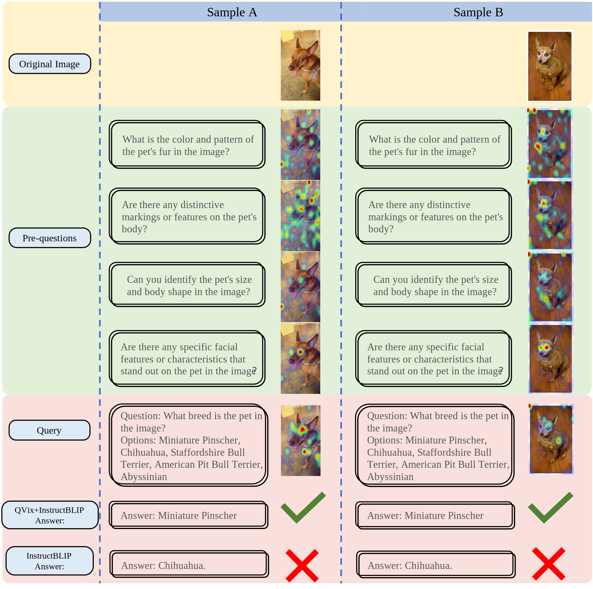
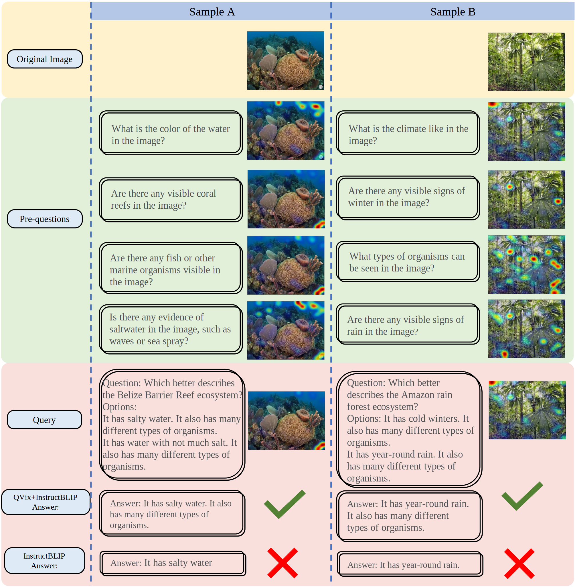

# Good Questions Help Zero-Shot Image Reasoning

[Good Questions Help Zero-Shot Image Reasoning](https://arxiv.org/abs/2312.5271167)

QVix leverages LLMs' strong language prior to generate input-exploratory questions with more details than the original query, guiding LVLMs to explore visual content more comprehensively and uncover subtle or peripheral details. QVix enables a wider exploration of visual scenes, improving the LVLMs’ reasoning accuracy and depth in tasks such as visual question answering and visual entailment.

## Cases

QVix can utilize **detailed information** to better distinguish between options that are easily confused, and achieve a more comprehensive and systematic understanding of images through **contextual information**.

# Case 1. Detailed Information: Miniature Pinscher vs. Chihuahua 

# Case 2. Contextual Information: Describe the system depicted in the image

